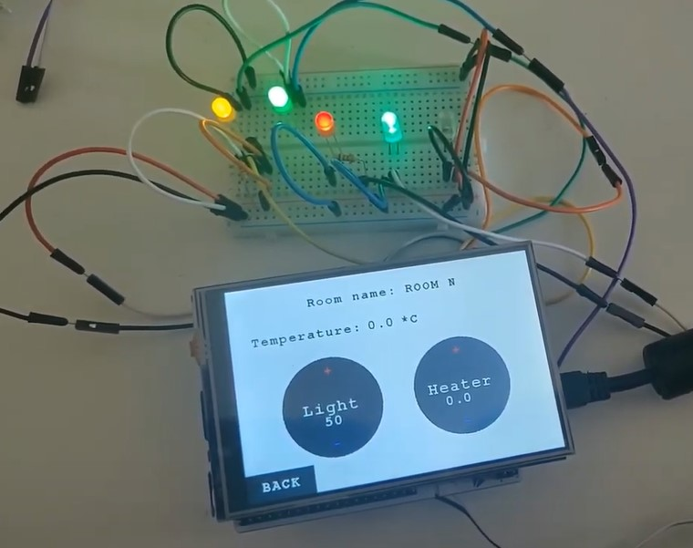
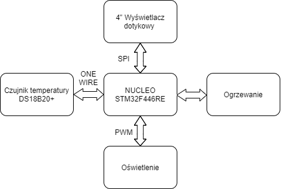

# STMSmartHome
Smart Home system realised on STM with use of C++ language.

Product features:
* 4" touch screen,
* temperature measurement,
* light brightness control,
* heating control,
* statistics,
* time controled settings.

Result:  
(click on the images to move to the specific movie on our YouTube channel)  
  
  

## Documentation
### Instructions
* [how to build first time](docs/BUILDING.md "BUILD.md")
* [how to connect devices to stm (pinout)](docs/PINOUT.md "PINOUT.md")

### Block diagram

### UML

### Design
* [GUI project](docs/GUIProject.md "GUIProject.md")

## Links
* [software sources](/src/sw/Core/ "software_sources")
