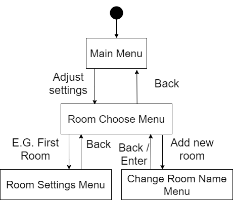
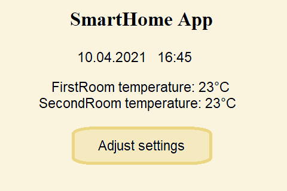
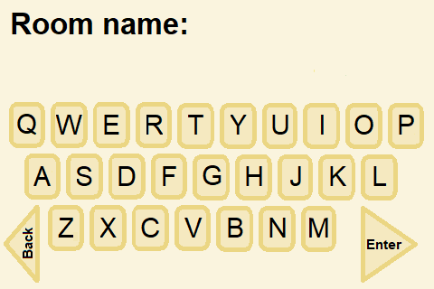

# GUI design
## Colors
* Background - #FCF5D8
* Button background - #F2D9B0
* Frames - #CD8742

---
> Decided to stay with black and white as display have problems with colors.
---

## State diagram

## Menu projects
### Main menu

### Room settings menu
  

### Room choose menu

### Change string value menu

### Other things probably needed to have:
* change number value menu,
* add new device menu extensions like unit type, limits (min and max value), pins where connected the device is.
