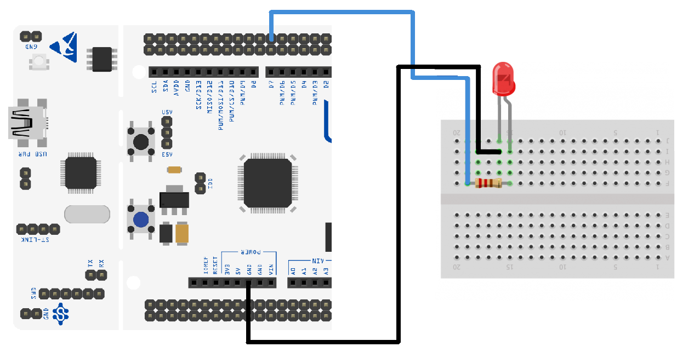
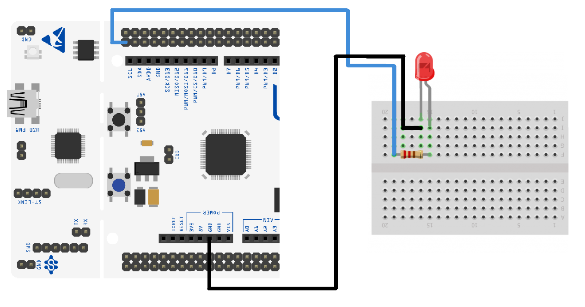

# Allocation of pins for room's controllers and sensors

Room 1:
* SENSOR: PC8
* LIGHT: PB14
* Heater: PC9

Room 2:
* SENSOR: PC6
* LIGHT: PB15
* Heater: PB8

Room 3:
* SENSOR: PC5
* Heater: PB9

# PINOUT for digital temperature sensor DS18B20
                                                NUCLEO PIN                SENSOR PIN
                                       PC8 | PC6 | PC5  <------------------>  DQ
                                                   +5V  <------------------>  VDD (+)
                                                   GND  <------------------>  GND (-)
Pull up resistor should be connected between pin VDD and DQ to assure correct work of temperature sensor.

Schematic of correct connections:

# PINOUT for light
                                                NUCLEO PIN                LED PIN
                                            PB14 | PB15  <------------------>  PWM (+)
                                                   GND   <------------------>  GND (-)
Schematic of correct connections:

# PINOUT for heater
                                                NUCLEO PIN                HEATER PIN
                                        PC9 | PB8 | PB9  <------------------>  GPIO (+)
                                                   GND   <------------------>  GND (-)
An LED diode was used for presentation purposes.               
Schematic of correct connections:

             
        
